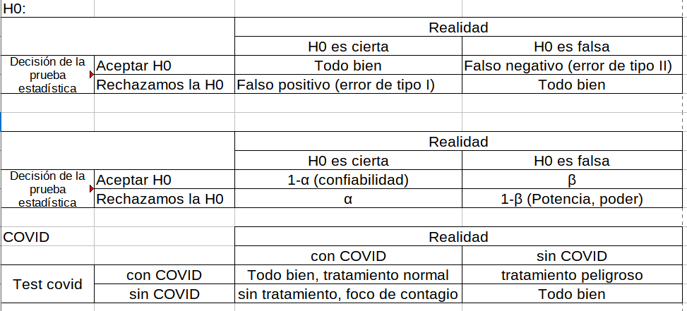

# Prueba de Hipótesis

Dado que el principal objetivo de la inferencia estadística es aproximarse al valor de los parámetros ($\theta$) mediante un estimador muestral $\hat{\theta}$ que viene de una distribución muestral y por lo tanto es una variable aleatoria también. 

Otra estrategia a parte de la estimación (puntual o por intervalos) del parámetro $\theta$ es la de plantear hipótesis al rededor de los valores del parámetro. A esto le vamos a denominar una prueba de hipótesis, donde solamente existen dos posibles resultados; Rechazamos la hipótesis o no la rechazamos.  

En este tema se explora las pruebas de hipótesis estadísticas sobre parámetros comunes, vistos anteriormente:

  + Media
  + Diferencia de medias
  + Proporción
  + Diferencia de proporciones
  + Datos pareados (colección de información de la misma unidad, en diversos momentos del tiempo)
  + Varianza
  + Igualdad de varianza

Adicionalmente, al final del tema se vera la pruebas de **bondad de ajuste**, que se sirven para plantear cuando una serie de datos tiene una determinada distribución
  
Todas las pruebas que se verán están enmarcadas en lo paramétrico, es decir, se realizarán supuestos respecto la distribución de la información y se trabaja con distribuciones conocidas como; la normal, t-student, $\chi^2$, F.

Mencionar que existen las pruebas de hipótesis **no paramétricas**, estas funcionan sobre las distribuciones libres. 
  
## Introducción

### Hipótesis estadística
Tener presente que la hipótesis que se defina debe estar siempre en términos del parámetro, no de la muestra. Cuando elaboramos una hipótesis esta tiene dos elementos; la hipótesis que se plantea (hipótesis nula) y el complemento de esta hipótesis (hipótesis alternativa), esta última puede ser de un lado o de dos lados. 

$$H_0: \theta = k$$
$$H_1: \theta \neq k \quad(\text{2 lados})$$
$$H_1: \theta < k \quad(\text{1 lado})$$
$$H_1: \theta > k \quad(\text{1 lado})$$

### Región de aceptación y región de rechazo
Al plantear un hipótesis estadística sobre un parámetro de alguna población, la manera de verificar dicha hipótesis pasara por estudiar una muestra aleatoria sobre la cual se establecera una regla que nos permita decir si la hipótesis es correcta o no. Tradicionalmente se definirá un estadístico de prueba que nos permitirá decidir. Por ejemplo, estamos interesados en conocer el promedio de ingresos laborales mensuales de las personas que viven en el municipio de La Paz. Planteamos la hipótesis nula:

$$H_0: \mu_{ingreso}=3000.Bs$$
La hipótesis alternativa

$$H_1: \mu_{ingreso} \neq 3000.Bs$$
Imaginemos que tomamos una muestra aleatoria de personas del municipio de La Paz y les consultamos acerca de su ingreso laboral mensual, el resultado del promedio muestral es de 

$$\bar{x}=?$$

Una regla para contrastar una hipótesis es definir la región de aceptación y la región de rechazo, en este ejemplo podemos momentaneamente de forma arbitraria podemos decir que "aceptamos" la $H_0$ si 

$$2700\leq\bar{x}\leq 3100$$

En otro caso, se rechaza la hipótesis y la región que esta fuera de la región de aceptación se conoce como región de rechazo ($\bar{x}<2700$ ó $\bar{x}>3100$).

> Nota: En la práctica, normalmente la región de aceptación para pruebas de 2 lados coincide con el intervalo de confianza.

Tener presente los conceptos de:

  + Hipótesis nula
  + Hipótesis alternativa (1 lado, 2 lados)
  + Estadístico de prueba
  + Región de aceptación 
  + Región de rechazo
  + Error de tipo I
  + Error de tipo II

### Errores de tipo I y errores de tipo II
(investigar de que se trata y buscar ejemplos)

- (Falso positivo) Error de tipo I ($\alpha$)
- (Falso negativos) Error de tipo II ($\beta$)

Investigar acerca de la Curva de característica de operación en pruebas de hipótesis

### Pasos para la prueba hipótesis estadística

## Prueba de hipótesis sobre la media

## Prueba de hipótesis sobre la diferencia de medias

## Prueba de hipótesis sobre la proporción

## Prueba de hipótesis sobre la diferencia de Proporciones

## Tamaño de muestra 

## Prueba de hipótesis sobre la varianza

## Prueba de hipótesis sobre la igualdad de varianzas

## Bondad de ajuste

